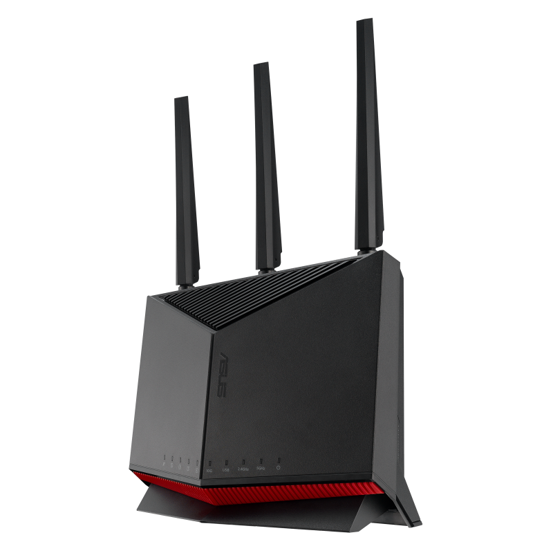

# 华硕路由器Clash翻墙实战教程（确实可用的方案）

> 基于华硕RT-AX86U PRO的Clash部署全屋科学上网方案，
> 是经过多天的实践，踩了多个大坑，确实可行的方案。

> 给大家个建议，不要过度相信网上各种推广文章，使用诸如ExpressVPN之类的海外知名VPN，
> 这类厂商都十分容易被针对，这是非常深刻的教训，不要过多浪费自己的时间。
> 目前比较流行使用机场节点翻墙,经过实践，稳定可靠，
> 不论是官改的固件，还是梅林的固件，目前都已经十分成熟了，不要纠结官方的固件，
> 如果你实在纠结，后期还是可以重新刷回来的，华硕刷固件的稳定性真是没得说。

## 📋 目录

- [快速开始](#快速开始)
- [硬件准备](#硬件准备)
- [梅林固件刷机](#梅林固件刷机)
- [Clash安装配置](#clash安装配置)
- [高级功能配置](#高级功能配置)
- [监控与维护](#监控与维护)
- [故障排除](#故障排除)
- [安全与隐私](#安全与隐私)

## 🚀 快速开始

### 10分钟快速部署

如果您已经拥有华硕RT-AX86U PRO路由器，可以按照以下步骤快速部署Clash：

#### 第一步：刷入梅林固件
1. 下载[梅林固件](https://www.asuswrt-merlin.net/)
2. 进入路由器管理界面 → 系统管理 → 固件升级
3. 上传固件文件，等待刷机完成

#### 第二步：安装Clash
1. 进入软件中心，离线安装"meilin Clash"
2. 点击安装，等待安装完成

#### 第三步：配置透明代理
1. 进入Clash设置页面
2. 配置clash订阅
3. 启用透明代理功能，
4. 查看管理面板

#### 第四步：测试连接
1. 重启路由器
2. 访问Google、YouTube等网站
3. 检查IP地址是否已改变

### 完整配置时间
- **新手用户**: 30-60分钟
- **有经验用户**: 15-30分钟
- **专业用户**: 5-10分钟

### 所需工具
- 华硕RT-AX86U PRO路由器
- 电脑（Windows/Mac/Linux）
- 稳定的网络连接
- VPN服务商账号（可选）

## 🔧 硬件准备

### 推荐路由器型号

| 品牌 | 型号 | CPU | 内存 | 存储 | 价格区间 | 推荐指数 | 备注 |
|------|------|-----|------|------|----------|----------|------|
| 华硕 | RT-AX86U PRO | 博通四核2.0GHz | 1GB | 256MB | 800-1000元 | ⭐⭐⭐⭐⭐ | **推荐首选** |
| 华硕 | RT-AX88U | 博通四核1.8GHz | 1GB | 256MB | 1200-1500元 | ⭐⭐⭐⭐⭐ | 8个LAN口 |
| 华硕 | RT-AC86U | 博通双核1.8GHz | 512MB | 128MB | 400-600元 | ⭐⭐⭐⭐ | 性价比之选 |
| 小米 | AX6000 | IPQ5018 | 512MB | 128MB | 400-500元 | ⭐⭐⭐⭐ | 需刷OpenWrt |
| 网件 | R7800 | IPQ8065 | 512MB | 128MB | 300-400元 | ⭐⭐⭐⭐ | 需刷OpenWrt |

### 最低配置要求

- **CPU**: 双核1.5GHz 或更高性能
- **内存**: 512MB RAM 或更多（推荐1GB+）
- **存储**: 128MB Flash 或更多（推荐256MB+）
- **网络**: 千兆以太网接口
- **固件支持**: 支持第三方固件（梅林/OpenWrt）

### 华硕RT-AX86U PRO 详细规格

| 规格项目 | 详细参数 | 说明 |
|---------|---------|------|
| **处理器** | 博通四核2.0GHz | 强大的处理性能，支持高并发连接 |
| **内存** | 1GB DDR4 | 充足内存支持Clash运行 |
| **存储** | 256MB Flash | 大容量存储，支持安装更多插件 |
| **无线性能** | Wi-Fi 6 (802.11ax)，160MHz | 双频并发5700Mbps |
| **有线接口** | 1×2.5G (WAN/LAN) + 1×1G WAN + 4×1G LAN | 高速网络连接 |
| **USB接口** | 1×USB 3.2 Gen1 + 1×USB 2.0 | 支持外接存储设备 |
| **价格区间** | 800-1000元 | 性价比极高的高端路由器 |
> **KoolCenter下载**：[RT-AX86U PRO梅林固件](https://www.koolcenter.com/fw/device/rt-ax88u_pro/merlin)
> **京东购买推荐**：[京东自营RT-AX86U PRO路由器优惠购买链接](https://union-click.jd.com/jdc?e=618%7Cpc%7C&p=JF8BAS8JK1olXwABU19YDUgeA18IGloUXwAKVFlbC08nRzBQRQQlBENHFRxWFlVPRjtUBABAQlRcCEBdCUoWAWkAG1wTXgIdDRsBVXt_dCR_SBxKLmMDBBgKFk9XfzNvYV9TUQoyVW5eCUsTAWkJHVkTbTYCU24OZhtVRy3RncXD-IbW_MdtCXsXBWsBHlgVWgMCUltVOEwXCl9YQxlMDVlUHRoJOHsnAF8PG1IBW3RDBkpbensnA18LK1sUXQcLVF9eDE8WH28MGVoSVRoCUlpUDUgXB2oOHV8cbQQDVVpUOHvJjt92a1pLHXNiHBs5CElDdwYJxdalTHp1XVxfDFonWChjbD50WQ9YMiEEQC4VRypTGyBDXXJiOlxZC09XVTR7fAFyGVBiVjspSXsSM2gOGms)  
> 通过此链接购买可支持本项目持续更新，感谢支持！

### 为什么选择RT-AX86U PRO？

1. **性能强劲**：四核2.0GHz处理器，1GB内存，运行Clash毫无压力
2. **梅林固件支持**：完美支持第三方梅林固件，功能丰富
3. **稳定性好**：华硕品质保证，长期运行稳定
4. **扩展性强**：支持多种插件和自定义功能
5. **性价比高**：相比其他品牌同配置产品价格更实惠

#### 华硕RT-BE86U 高端旗舰推荐

- 定位：Wi‑Fi 7 高端旗舰，面向高端与多设备并发场景

### 华硕RT-BE86U 详细规格

| 规格项目 | 详细参数 | 说明 |
|---------|---------|------|
| **处理器** | 博通高性能平台 | 面向Wi‑Fi 7的高并发、多客户端场景 |
| **内存** | 1GB+ DDR4 | 充足内存，适配多插件与并发连接 |
| **存储** | 256MB+ Flash | 可用于安装软件中心与扩展插件 |
| **无线性能** | Wi‑Fi 7 (802.11be) | 更高吞吐、更低时延、更强抗干扰 |
| **有线接口** | 2.5G高速口 + 多口千兆LAN | 满足多千兆宽带/NAS内网高速需求 |
| **USB接口** | USB 3.2 Gen1 | 支持外接存储/下载等扩展场景 |
| **固件支持** | 支持梅林固件 | 通过KoolCenter获取固件 |

> 固件下载：[KoolCenter RT‑BE86U Merlin](https://www.koolcenter.com/fw/device/rt-be86u/merlin)  
> 京东购买推荐：[RT‑BE86U 优惠购买链接](https://union-click.jd.com/jdc?e=618%7Cpc%7C&p=JF8BAS8JK1olXwABU19YDUgeA18IGloUVA8KUldaCUsnRzBQRQQlBENHFRxWFlVPRjtUBABAQlRcCEBdCUoWCmYAHVISXAYdDRsBVXtcVAlqbwFdJ2R9VylDARlUZDRJaShDUQoyVW5eCUsTAWkJHVkTbTYCU24OZhtVRy3RncXD-IbW_MdtCXsXBWsBHlgdVAAHUF9eOEwXCl9YQxlMDVlUHRoJOHsnAF8PG1IBW3RDBkpbensnA18LK1sUXQcLVF9eDE8WH28MGVoSVRoCUlpUDUgXB2oOHV8cbQQDVVpUOHvJjt99Hl4QJwZZUFdaWCNICxBSxdalTHRyVFpcDlonVC1hZDB3P1wGAiocUilMBy1YEgxeXQRcOlwZUDMSQWxsRl92BlpKKCwKfHsSM2gOGms)

### 为什么选择RT-BE86U？

1. **前沿无线**：Wi‑Fi 7标准，显著提升吞吐与并发表现
2. **高速有线**：提供2.5G高速口，适配多千兆与NAS应用
3. **梅林生态**：支持梅林固件，软件中心与插件扩展丰富
4. **稳定低时延**：优化游戏/影音/远程办公的时延与稳定性
5. **面向未来**：更长期的硬件生命周期，更适合高端/重度用户

## 🔄 梅林固件刷机

### 1. 梅林固件介绍

**梅林固件（ASUSWRT-Merlin）**是基于华硕官方固件的第三方增强版本，专为华硕路由器优化：

- **优点**: 
  - 基于华硕官方固件，稳定性极高
  - 保留所有官方功能，增加更多高级选项
  - 支持多种插件和自定义脚本
  - 社区活跃，更新及时
  - 完美支持Clash等代理工具

- **缺点**: 
  - 仅支持华硕路由器
  - 需要一定的技术基础

- **适用**: 华硕路由器用户，追求稳定性和功能性的用户

### 2. 刷机前准备

#### 检查路由器型号
确保您的路由器型号为RT-AX86U PRO，其他支持的型号包括：
- RT-AX88U、RT-AX86U、RT-AX68U
- RT-AC86U、RT-AC88U、RT-AC68U
- RT-AX56U、RT-AX58U、RT-AX82U
- TUF-AX3000、TUF-AX5400
- GT-AX6000、GT-AX11000

#### 下载梅林固件

**通过KoolCenter下载（推荐）**
下载链接位于设备说明的下方

**固件版本说明：**
- **梅林386改版固件**：基于华硕官方386固件，功能最全面
- **梅林384改版固件**：基于华硕官方384固件，稳定性更好
- **官改固件**：在官方固件基础上增加插件支持

### 3. 刷机步骤

#### 第一步：进入路由器管理界面
1. 在浏览器中输入 `http://192.168.50.1` 或 `http://router.asus.com`
2. 使用管理员账号登录（用户名和密码都是自己设置的）

#### 第二步：固件双清（如果是新路由器不需要）
1. 进入【系统管理 】
2.【 恢复/导出/上传设置】，勾选恢复按钮旁的选择框，然后点击恢复按钮

#### 第三步：上传梅林固件
1. 进入"系统管理" → "固件升级"
2. 点击"选择文件"，选择下载的梅林固件
3. 点击"上传"开始刷机

#### 第四步：等待刷机完成
- 刷机过程大约需要3-5分钟
- 期间请勿断电或重启路由器
- 路由器会自动重启

### 4. 验证刷机成功

#### 检查固件版本
1. 重新登录路由器管理界面
2. 查看"系统信息" → "固件版本"
3. 确认显示为梅林固件版本

#### 检查软件中心
梅林固件新增的功能包括：
- 软件中心（Software Center）
- 络更多网工具
- 高级网络设置
- 自定义脚本支持

## ⚙️ Clash安装配置

### 1. Clash介绍

**MerlinClash**是专为华硕梅林固件开发的Clash插件，具有以下特点：

- **支持协议**: Shadowsocks、ShadowsocksR、VMess、Trojan、Hysteria、WireGuard
- **性能优异**: 低延迟、高并发、内存占用少
- **规则引擎**: 强大的分流规则系统
- **配置灵活**: 支持订阅和自定义配置
- **稳定可靠**: 长期运行不崩溃
- **图形界面**: 提供Web管理界面，操作简单

### 2. 下载MerlinClash插件
————————————————————————————————————————————————
【MerlinClash禁止转发国内网站】,这是官方版权声明，请自觉遵守
————————————————————————————————————————————————
#### 从本项目 soft 目录下载
1. 打开本仓库的 `soft` 目录
2. 根据您的路由器型号选择对应版本：
   - **RT-AX86U PRO 等 ARM64 路由器**：下载 [MC2_0.4.6_ARM64.tar.gz](https://mowei-ie.github.io/router-vpn/MC2_0.4.6_ARM64.tar.gz)（推荐）或 [MC2_0.3_ARM64.tar.gz](https://mowei-ie.github.io/router-vpn/MC2_0.3_ARM64.tar.gz)
   - 在链接上点右键，使用“链接另存为”进行下载
   - 梅林Clash也可以通过 [Telegram下载频道](https://t.me/s/merlinclashfile) 获取最新版本（需有Telegram账号）

**支持的华硕路由器型号：**

- **ARM64版本 MC2_0.3**：
  支持
  - BE6500
  - BE88U/BE86U/BE96U/BE3600
  - AC86U/GT5300
  - AX68U/AX86U/AX88U/AX92U/AX11000
  - AX11000 pro/AX86U pro/AX88U pro/GT-AX6000
  - TX-AX6000/TUF-AX4200q/GS7
  - RAX80 等

- **ARM64版本 MC2_0.4.6**：
  支持
  - BE6500
  - BE88U/BE86U/BE96U/BE3600
  - AC86U/GT5300
  - AX68U/AX86U/AX88U/AX92U/AX11000
  - AX11000 pro/AX86U pro/AX88U pro/GT-AX6000
  - TX-AX6000/TUF-AX4200q/GS7
  - RAX80 等

- **ARM32版本 MC2_0.4.6**：
  支持
  - BD4
  - AX3000/AX5400/AX6600/GT6
  - AX82U/AX56U/AX58U/AX1800
  - AX89X
  - RAX50 等

### 3. 安装MerlinClash插件

#### 第一步：升级软件中心
1. 进入路由器管理界面
2. 进入"软件中心"
3. 点击"更新"按钮，升级软件中心到最新版本

#### 第二步：离线安装MerlinClash
1. 进入"软件中心" → "离线安装"
2. 点击"选择文件"，选择下载的MerlinClash插件包
3. 点击"上传并安装"
4. 等待安装完成

#### 第三步：启用MerlinClash
1. 安装完成后，在软件中心找到"MerlinClash"
2. 点击"启动"按钮
3. 等待插件启动完成

### 4. 配置MerlinClash

#### 基本配置
1. 进入MerlinClash管理界面
2. 点击"基本设置"
3. 配置以下参数：
   - **运行模式**: 选择"透明代理"
   - **端口设置**: 保持默认（7890、7891）
   - **DNS设置**: 使用默认DNS配置

#### 申请clash订阅

查看教程：<a href="https://mowei-ie.github.io/router-vpn/clash-subscription-guide.html" target="_blank">申请 Clash 订阅指南</a>

#### 订阅配置
1. 点击"订阅设置"
2. 输入您的机场订阅链接
3. 点击"更新订阅"
4. 等待节点更新完成

#### 分流规则配置
1. 点击"规则设置"
2. 选择合适的分流规则
3. 可以自定义规则或使用预设规则

### 5. 测试连接

#### 检查MerlinClash状态
1. 进入MerlinClash管理界面
2. 查看"运行状态"，确认显示"运行中"
3. 检查"节点列表"，确认节点已加载

#### 测试网络连接
1. 在浏览器中访问 `http://www.google.com`
2. 检查是否能正常访问
3. 访问 `https://www.whatismyipaddress.com` 验证IP地址

### 6. 高级功能

#### 智能分流
MerlinClash支持智能分流功能：
- **游戏加速**：自动为游戏流量选择最优节点
- **流媒体解锁**：支持Netflix、YouTube等流媒体平台
- **广告屏蔽**：自动屏蔽广告域名
- **国内直连**：国内网站直接连接，提高访问速度

#### 管理面板
MerlinClash提供Web管理面板：
- **节点管理**：查看、测试、切换节点
- **规则管理**：自定义分流规则
- **日志查看**：查看运行日志和错误信息
- **性能监控**：监控CPU、内存使用情况

## 🎯 高级功能配置

### 1. 智能分流设置

#### 游戏加速
1. 进入MerlinClash管理界面
2. 点击"规则设置" → "游戏加速"
3. 选择游戏节点组
4. 启用游戏加速功能

#### 流媒体解锁
1. 点击"规则设置" → "流媒体解锁"
2. 选择流媒体节点组
3. 配置支持的流媒体平台

#### 广告屏蔽
1. 点击"规则设置" → "广告屏蔽"
2. 启用广告屏蔽功能
3. 选择广告屏蔽规则

### 2. 性能优化

#### 节点选择策略
- **自动选择**：根据延迟自动选择最优节点
- **手动选择**：手动指定特定节点
- **负载均衡**：在多节点间分配流量

#### 分流规则优化
- **国内直连**：国内网站直接连接，提高访问速度
- **国外代理**：国外网站通过代理访问
- **特殊规则**：为特定应用设置特殊规则

### 3. 监控与维护（简版）
- 核心要点：
  - 在管理界面查看运行状态与性能监控
  - 通过日志查看定位问题
  - 定期更新订阅与规则，关注CPU/内存
- 详细说明请参见下文：[监控与维护](#监控与维护)

## 📊 监控与维护

### 1. 日常维护

#### 定期检查
- **每周检查**：MerlinClash运行状态
- **每月更新**：订阅节点和规则
- **定期重启**：路由器定期重启保持稳定

#### 性能监控
1. 进入MerlinClash管理界面
2. 查看"性能监控"页面
3. 监控CPU、内存、网络使用情况

### 2. 日志分析
1. 进入MerlinClash管理界面
2. 点击"日志查看"
3. 分析错误信息和警告

## 🔧 故障排除

### 1. 常见问题

#### 问题1：无法下载文件
**症状**：无法下载梅林固件或MerlinClash插件
**解决方案**：
1. 检查网络连接是否正常
2. 尝试使用VPN或代理访问
3. 使用备用下载链接
4. 联系网络服务提供商

#### 问题2：插件安装失败
**症状**：MerlinClash插件安装时出现错误
**解决方案**：
1. 确保软件中心已升级到最新版本
2. 检查插件包是否完整下载
3. 尝试重新下载插件包
4. 使用google浏览器进行安装---这个很重要
5. 检查路由器存储空间是否充足

#### 问题3：无法访问外网
**症状**：MerlinClash运行正常但无法访问外网
**解决方案**：
1. 检查MerlinClash运行状态
2. 验证节点是否可用
3. 检查分流规则设置
4. 检查流量是否超过限定，订阅是否到期
4. 重启MerlinClash服务

#### 问题4：速度慢
**症状**：网络连接速度很慢
**解决方案**：
1. 更换更快的节点
2. 调整分流规则
3. 检查网络带宽
4. 优化路由器性能

### 2. 调试方法

#### 检查运行状态
1. 进入MerlinClash管理界面
2. 查看"运行状态"页面
3. 检查各项指标是否正常

#### 查看日志信息
1. 点击"日志查看"
2. 分析错误信息和警告
3. 根据日志信息排查问题

#### 测试网络连接
1. 在浏览器中访问测试网站
2. 检查IP地址是否已改变
3. 验证代理是否生效

## 🔒 安全与隐私

### 1. 安全建议

#### 路由器安全
- **定期更新固件**：保持梅林固件为最新版本
- **修改默认密码**：更改路由器管理密码
- **启用防火墙**：使用路由器内置防火墙功能
- **关闭不必要服务**：关闭不需要的网络服务

#### MerlinClash安全
- **使用HTTPS**：在配置中使用HTTPS订阅链接
- **定期更新**：及时更新MerlinClash插件
- **监控日志**：定期查看运行日志
- **备份配置**：定期备份重要配置

### 2. 隐私保护

#### DNS泄露防护
MerlinClash内置DNS泄露防护功能：
- 自动使用代理DNS服务器
- 防止DNS查询泄露真实IP
- 支持自定义DNS服务器

#### 流量加密
- 所有代理流量都经过加密传输
- 支持多种加密协议
- 防止流量被监听和分析

### 3. 使用建议

#### 合法使用
- 遵守当地法律法规
- 不用于非法活动
- 合理使用网络资源

#### 性能优化
- 选择稳定的节点
- 定期清理日志文件
- 监控系统资源使用

## 📚 附录

### 1. 支持的路由器型号

#### ARM64版本（推荐）
- RT-AX86U PRO、RT-AX88U、RT-AX68U、RT-BE86U
- RT-AC86U、RT-AC88U、RT-AC68U
- TUF-AX3000、TUF-AX5400
- GT-AX6000、GT-AX11000

#### ARM32版本
- RT-AX3000、RT-AX5400、RT-AX6600
- RT-AX56U、RT-AX58U、RT-AX82U
- RT-AX89X、RAX50

### 2. 故障排除检查清单

- [ ] 路由器固件是否正确安装
- [ ] 软件中心是否已升级到最新版本
- [ ] MerlinClash插件是否正常安装
- [ ] 订阅链接是否正确配置
- [ ] 节点是否可用
- [ ] 分流规则是否正确设置
- [ ] 网络连接是否正常

### 3. 性能优化建议

#### 路由器优化
- 定期重启路由器保持稳定
- 保持固件为最新版本
- 合理设置Wi-Fi参数
- 监控CPU和内存使用情况

#### MerlinClash优化
- 选择稳定的节点
- 合理配置分流规则
- 定期更新订阅
- 监控运行状态

### 4. 常用操作

#### 重启MerlinClash
1. 进入MerlinClash管理界面
2. 点击"停止"按钮
3. 等待停止完成后点击"启动"

#### 更新订阅
1. 进入MerlinClash管理界面
2. 点击"订阅设置"
3. 点击"更新订阅"按钮

#### 查看日志
1. 进入MerlinClash管理界面
2. 点击"日志查看"
3. 查看运行日志和错误信息

---

## ⚠️ 免责声明

本教程仅供学习和研究使用，请遵守当地法律法规。使用本教程所产生的任何后果，作者不承担任何责任。请合理使用网络资源，尊重他人的知识产权。

## 📞 技术支持

如果您在使用过程中遇到问题，可以通过以下方式获取帮助：

1. 查看本文档的故障排除部分
2. 搜索相关技术论坛
3. 查看Clash官方文档
4. 提交Issue到项目仓库

---

## 📝 版本更新说明

### v2.0 (2024年1月)
- ✅ 添加官方下载链接：[KoolCenter梅林固件](https://www.koolcenter.com/fw/device/rt-ax88u_pro/merlin)
- ✅ 添加Telegram Clash文件下载：[撸猫云频道](https://t.me/s/merlinclashfile)
- ✅ 优化华硕RT-AX86U PRO专用配置
- ✅ 增加详细的文件上传和安装步骤
- ✅ 完善故障排除指南
- ✅ 添加性能优化建议

### v1.0 (2024年1月)
- ✅ 基础教程框架
- ✅ 硬件介绍和推荐
- ✅ 梅林固件刷机指南
- ✅ Clash配置教程
- ✅ 网络配置说明

### 计划更新
- 🔄 添加更多路由器型号支持
- 🔄 增加视频教程链接
- 🔄 优化配置文件模板
- 🔄 添加自动化安装脚本

---

**最后更新**: 2024年1月  
**版本**: v2.0  
**作者**: Router VPN Team

### 参考资源
- [KoolCenter梅林固件下载](https://www.koolcenter.com/fw/device/rt-ax88u_pro/merlin)
- [撸猫云Clash文件频道](https://t.me/s/merlinclashfile)
- [梅林固件官方GitHub](https://github.com/RMerl/asuswrt-merlin.ng)
- [Clash官方文档](https://clash.gitbook.io/)
