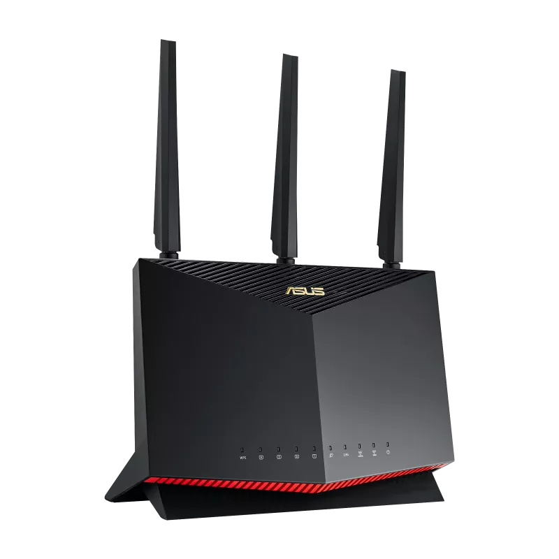

# 华硕路由器Clash翻墙实战教程

> 基于华硕RT-AX86U PRO的Clash部署全屋科学上网方案

## 📋 目录

- [快速开始](#快速开始)
- [硬件准备](#硬件准备)
- [梅林固件刷机](#梅林固件刷机)
- [Clash安装配置](#clash安装配置)
- [网络配置与透明代理](#网络配置与透明代理)
- [高级功能配置](#高级功能配置)
- [监控与维护](#监控与维护)
- [故障排除](#故障排除)
- [安全与隐私](#安全与隐私)

## 🚀 快速开始

### 5分钟快速部署

如果您已经拥有华硕RT-AX86U PRO路由器，可以按照以下步骤快速部署Clash：

#### 第一步：刷入梅林固件
1. 下载[梅林固件](https://www.asuswrt-merlin.net/)
2. 进入路由器管理界面 → 系统管理 → 固件升级
3. 上传固件文件，等待刷机完成

#### 第二步：安装Clash
1. 进入软件中心，搜索"Clash"
2. 点击安装，等待安装完成
3. 配置代理节点信息

#### 第三步：配置透明代理
1. 进入Clash设置页面
2. 启用透明代理功能
3. 配置分流规则

#### 第四步：测试连接
1. 重启路由器
2. 访问Google、YouTube等网站
3. 检查IP地址是否已改变

### 完整配置时间
- **新手用户**: 30-60分钟
- **有经验用户**: 15-30分钟
- **专业用户**: 5-10分钟

### 所需工具
- 华硕RT-AX86U PRO路由器
- 电脑（Windows/Mac/Linux）
- 稳定的网络连接
- VPN服务商账号（可选）

### 下载链接汇总

#### 梅林固件下载
- **KoolCenter下载**：[RT-AX86U PRO梅林固件](https://www.koolcenter.com/fw/device/rt-ax88u_pro/merlin)
- **官方GitHub**：[梅林固件官方发布页](https://github.com/RMerl/asuswrt-merlin.ng/releases)

#### Clash文件下载
- **Telegram频道**：[撸猫云Clash文件](https://t.me/s/merlinclashfile)
- **推荐版本**：MC_ARM64_250124.tar.gz（RT-AX86U PRO专用）

#### 其他工具
- **SSH客户端**：PuTTY（Windows）、Terminal（Mac/Linux）
- **文件传输**：WinSCP（Windows）、FileZilla（跨平台）

## 🔧 硬件准备

### 华硕RT-AX86U PRO 详细规格



| 规格项目 | 详细参数 | 说明 |
|---------|---------|------|
| **处理器** | 博通四核1.8GHz | 强大的处理性能，支持高并发连接 |
| **内存** | 1GB DDR4 | 充足内存支持Clash运行 |
| **存储** | 256MB Flash | 大容量存储，支持安装更多插件 |
| **无线性能** | Wi-Fi 6 (802.11ax) | 双频并发5700Mbps |
| **有线接口** | 1×2.5G WAN + 4×1G LAN | 高速网络连接 |
| **USB接口** | 2×USB 3.0 | 支持外接存储设备 |
| **价格区间** | 800-1000元 | 性价比极高的高端路由器 |

### 为什么选择RT-AX86U PRO？

1. **性能强劲**：四核1.8GHz处理器，1GB内存，运行Clash毫无压力
2. **梅林固件支持**：完美支持第三方梅林固件，功能丰富
3. **稳定性好**：华硕品质保证，长期运行稳定
4. **扩展性强**：支持多种插件和自定义功能
5. **性价比高**：相比其他品牌同配置产品价格更实惠

### 其他推荐路由器型号

| 品牌 | 型号 | CPU | 内存 | 存储 | 价格区间 | 推荐指数 | 备注 |
|------|------|-----|------|------|----------|----------|------|
| 华硕 | RT-AX86U PRO | 博通四核1.8GHz | 1GB | 256MB | 800-1000元 | ⭐⭐⭐⭐⭐ | **推荐首选** |
| 华硕 | RT-AX88U | 博通四核1.8GHz | 1GB | 256MB | 1200-1500元 | ⭐⭐⭐⭐⭐ | 8个LAN口 |
| 华硕 | RT-AC86U | 博通双核1.8GHz | 512MB | 128MB | 400-600元 | ⭐⭐⭐⭐ | 性价比之选 |
| 小米 | AX6000 | IPQ5018 | 512MB | 128MB | 400-500元 | ⭐⭐⭐⭐ | 需刷OpenWrt |
| 网件 | R7800 | IPQ8065 | 512MB | 128MB | 300-400元 | ⭐⭐⭐⭐ | 需刷OpenWrt |

### 最低配置要求

- **CPU**: 双核1.5GHz 或更高性能
- **内存**: 512MB RAM 或更多（推荐1GB+）
- **存储**: 128MB Flash 或更多（推荐256MB+）
- **网络**: 千兆以太网接口
- **固件支持**: 支持第三方固件（梅林/OpenWrt）

## 🔄 梅林固件刷机

### 1. 梅林固件介绍


**梅林固件（ASUSWRT-Merlin）**是基于华硕官方固件的第三方增强版本，专为华硕路由器优化：

- **优点**: 
  - 基于华硕官方固件，稳定性极高
  - 保留所有官方功能，增加更多高级选项
  - 支持多种插件和自定义脚本
  - 社区活跃，更新及时
  - 完美支持Clash等代理工具

- **缺点**: 
  - 仅支持华硕路由器
  - 需要一定的技术基础

- **适用**: 华硕路由器用户，追求稳定性和功能性的用户

### 2. 刷机前准备

#### 检查路由器型号
确保您的路由器型号为RT-AX86U PRO，其他支持的型号包括：
- RT-AX88U
- RT-AX86U
- RT-AC86U
- RT-AC88U
- RT-AC68U

#### 下载梅林固件

**方法一：通过KoolCenter下载（推荐）**
1. 访问[KoolCenter梅林固件下载页面](https://www.koolcenter.com/fw/device/rt-ax88u_pro/merlin)
2. 选择RT-AX86U PRO对应的固件版本
3. 下载最新的稳定版本固件文件（.w格式）


**方法二：通过官方GitHub下载**
1. 访问[梅林固件官方GitHub](https://github.com/RMerl/asuswrt-merlin.ng/releases)
2. 找到RT-AX86U PRO对应的固件版本
3. 下载固件文件

**固件版本选择建议：**
- **稳定版**：适合日常使用，推荐新手选择
- **测试版**：包含最新功能，适合高级用户
- **开发版**：实验性功能，不推荐生产环境使用

#### 备份当前设置
```bash
# 通过SSH连接路由器
ssh admin@192.168.1.1

# 备份当前配置
nvram show > /tmp/backup_config.txt
```

### 3. 详细刷机步骤

#### 第一步：进入路由器管理界面
1. 在浏览器中输入 `http://192.168.1.1` 或 `http://router.asus.com`
2. 使用管理员账号登录（默认用户名/密码：admin/admin）


#### 第二步：备份当前设置
1. 进入"系统管理" → "设置管理"
2. 点击"备份"按钮，下载当前配置
3. 保存配置文件到安全位置


#### 第三步：上传梅林固件
1. 进入"系统管理" → "固件升级"
2. 点击"选择文件"，选择下载的梅林固件
3. 确保"恢复出厂设置"选项已勾选
4. 点击"上传"开始刷机


#### 第四步：等待刷机完成
- 刷机过程大约需要3-5分钟
- 期间请勿断电或重启路由器
- 路由器会自动重启


#### 第五步：恢复出厂设置
刷机完成后，建议进行恢复出厂设置：
1. 按住路由器背面的"Reset"按钮10秒
2. 等待路由器重启完成
3. 重新配置网络设置


### 4. 验证刷机成功

#### 检查固件版本
1. 重新登录路由器管理界面
2. 查看"系统信息" → "固件版本"
3. 确认显示为梅林固件版本


#### 检查新增功能
梅林固件新增的功能包括：
- 软件中心（Software Center）
- 更多网络工具
- 高级网络设置
- 自定义脚本支持


## ⚙️ Clash安装配置

### 1. Clash介绍


**Clash**是一个基于Go语言开发的多平台代理客户端，专为路由器环境优化：

- **支持协议**: Shadowsocks、ShadowsocksR、VMess、Trojan、Hysteria、WireGuard
- **性能优异**: 低延迟、高并发、内存占用少
- **规则引擎**: 强大的分流规则系统
- **配置灵活**: 支持订阅和自定义配置
- **稳定可靠**: 长期运行不崩溃

### 2. 华硕路由器Clash文件结构

```
/jffs/clash/                    # Clash主目录
├── clash                       # Clash可执行文件
├── config.yaml                 # 主配置文件
├── Country.mmdb                # GeoIP数据库
├── clash.log                   # 运行日志
└── rules/                      # 规则文件目录
    ├── gfwlist.yaml
    ├── chinalist.yaml
    └── custom.yaml
```

### 3. 安装Clash核心

#### 方法一：通过软件中心安装（推荐）


1. 进入路由器管理界面
2. 找到"软件中心"或"Software Center"
3. 搜索"Clash"或"科学上网"
4. 点击安装，等待安装完成

#### 方法二：手动安装

##### 下载Clash核心文件

**通过Telegram频道下载（推荐）**
1. 访问[撸猫云Clash文件频道](https://t.me/s/merlinclashfile)
2. 根据您的路由器型号选择对应版本：
   - **RT-AX86U PRO**: 下载 `MC_ARM64_250124.tar.gz` 或最新版本
   - **其他ARM64路由器**: 下载 `MC2_0.5.1_ARM64.tar.gz`
   - **ARM32路由器**: 下载 `MC2_0.5.1_ARM32.tar.gz`


**支持的华硕路由器型号：**
- **ARM64版本**：RT-AX86U PRO、RT-AX88U、RT-AX68U、RT-AC86U等
- **ARM32版本**：RT-AX3000、RT-AX5400、RT-AX56U等

##### 安装Clash文件

**步骤1：上传文件到路由器**

**方法A：通过Web界面上传**
1. 进入路由器管理界面
2. 进入"系统管理" → "文件管理"
3. 上传下载的tar.gz文件到/tmp目录

**方法B：通过SCP上传**
```bash
# Windows用户使用WinSCP
# Mac/Linux用户使用scp命令
scp MC_ARM64_250124.tar.gz admin@192.168.1.1:/tmp/
```

**步骤2：解压和安装**
```bash
# SSH登录路由器
ssh admin@192.168.1.1

# 创建Clash目录
mkdir -p /jffs/clash

# 解压文件
cd /tmp
tar -xzf MC_ARM64_250124.tar.gz

# 查看解压后的文件结构
ls -la clash/

# 复制文件到Clash目录
cp -r clash/* /jffs/clash/

# 赋予执行权限
chmod +x /jffs/clash/clash

# 验证文件权限
ls -la /jffs/clash/

# 清理临时文件
rm -rf /tmp/clash
rm -f /tmp/MC_ARM64_250124.tar.gz
```

**步骤3：验证安装**
```bash
# 测试Clash是否可执行
/jffs/clash/clash -v

# 检查文件结构
ls -la /jffs/clash/
```

##### 下载GeoIP数据库
```bash
# 下载Country.mmdb
cd /jffs/clash
wget https://github.com/Dreamacro/maxmind-geoip/releases/latest/download/Country.mmdb
```


### 4. 创建配置文件

#### 基础config.yaml配置
```yaml
# Clash配置文件 - 华硕路由器专用
port: 7890
socks-port: 7891
allow-lan: true
mode: rule
log-level: info
external-controller: 0.0.0.0:9090

# DNS配置 - 防止DNS泄露
dns:
  enable: true
  listen: 0.0.0.0:53
  enhanced-mode: fake-ip
  fake-ip-range: 198.18.0.1/16
  nameserver:
    - 223.5.5.5
    - 8.8.8.8
  fallback:
    - 1.1.1.1
    - 8.8.4.4
  fallback-filter:
    geoip: true
    geoip-code: CN
    ipcidr:
      - 240.0.0.0/4
      - 0.0.0.0/32

# 代理组配置
proxy-groups:
  - name: "自动选择"
    type: url-test
    proxies:
      - 香港节点
      - 新加坡节点
      - 美国节点
    url: 'http://www.gstatic.com/generate_204'
    interval: 300
    tolerance: 50

  - name: "手动选择"
    type: select
    proxies:
      - 自动选择
      - 香港节点
      - 新加坡节点
      - 美国节点
      - DIRECT

  - name: "国外网站"
    type: select
    proxies:
      - 自动选择
      - 手动选择
      - DIRECT

  - name: "游戏加速"
    type: url-test
    proxies:
      - 香港游戏节点
      - 新加坡游戏节点
    url: 'http://www.gstatic.com/generate_204'
    interval: 60

  - name: "流媒体解锁"
    type: select
    proxies:
      - 美国流媒体节点
      - 香港流媒体节点
      - 新加坡流媒体节点

# 代理节点配置
proxies:
  - name: "香港节点"
    type: ss
    server: hk.example.com
    port: 443
    cipher: aes-256-gcm
    password: "your_password"
    udp: true

  - name: "新加坡节点"
    type: vmess
    server: sg.example.com
    port: 443
    uuid: "550e8400-e29b-41d4-a716-446655440000"
    alterId: 0
    cipher: auto
    network: ws
    tls: true
    ws-opts:
      path: "/v2ray"
      headers:
        Host: sg.example.com

  - name: "美国节点"
    type: trojan
    server: us.example.com
    port: 443
    password: "your_password"
    udp: true
    sni: us.example.com

# 分流规则
rules:
  # 广告屏蔽
  - DOMAIN-SUFFIX,googlesyndication.com,REJECT
  - DOMAIN-SUFFIX,googletagmanager.com,REJECT
  - DOMAIN-SUFFIX,doubleclick.net,REJECT
  
  # 游戏加速
  - DOMAIN-SUFFIX,steamcommunity.com,游戏加速
  - DOMAIN-SUFFIX,steampowered.com,游戏加速
  - DOMAIN-SUFFIX,epicgames.com,游戏加速
  - DOMAIN-SUFFIX,battle.net,游戏加速
  
  # 流媒体解锁
  - DOMAIN-SUFFIX,netflix.com,流媒体解锁
  - DOMAIN-SUFFIX,youtube.com,流媒体解锁
  - DOMAIN-SUFFIX,disneyplus.com,流媒体解锁
  
  # 国外网站
  - DOMAIN-SUFFIX,google.com,国外网站
  - DOMAIN-SUFFIX,facebook.com,国外网站
  - DOMAIN-SUFFIX,twitter.com,国外网站
  - DOMAIN-SUFFIX,instagram.com,国外网站
  - DOMAIN-SUFFIX,github.com,国外网站
  
  # 国内网站直连
  - DOMAIN-SUFFIX,baidu.com,DIRECT
  - DOMAIN-SUFFIX,qq.com,DIRECT
  - DOMAIN-SUFFIX,taobao.com,DIRECT
  - DOMAIN-SUFFIX,tmall.com,DIRECT
  
  # 地理位置规则
  - GEOIP,CN,DIRECT
  - MATCH,国外网站
```


### 4. 订阅配置

#### 机场订阅配置
```yaml
# 在config.yaml中添加
proxy-providers:
  airport:
    type: http
    url: "https://your-airport.com/subscribe?token=your_token"
    interval: 3600
    path: ./proxies/airport.yaml
    health-check:
      enable: true
      interval: 600
      url: http://www.gstatic.com/generate_204

proxy-groups:
  - name: "机场节点"
    type: select
    use:
      - airport
```

#### 自建节点配置
```yaml
# 添加自建节点到proxies部分
proxies:
  - name: "自建V2Ray"
    type: vmess
    server: your-server.com
    port: 443
    uuid: "550e8400-e29b-41d4-a716-446655440000"
    alterId: 0
    cipher: auto
    network: ws
    tls: true
    ws-opts:
      path: "/v2ray"
      headers:
        Host: your-server.com
```

## 🚀 网络配置与透明代理

### 1. 配置Clash启动脚本

#### 创建启动脚本
```bash
# 创建启动脚本
cat > /jffs/scripts/services-start << 'EOF'
#!/bin/sh
# Clash启动脚本
/jffs/clash/clash -d /jffs/clash/ &
EOF

# 赋予执行权限
chmod +x /jffs/scripts/services-start
```


#### 创建停止脚本
```bash
# 创建停止脚本
cat > /jffs/scripts/services-stop << 'EOF'
#!/bin/sh
# Clash停止脚本
killall clash
EOF

chmod +x /jffs/scripts/services-stop
```

### 2. 配置透明代理

#### 创建iptables规则脚本
```bash
# 创建防火墙规则脚本
cat > /jffs/scripts/firewall-start << 'EOF'
#!/bin/sh
# Clash透明代理规则

# 创建自定义链
iptables -t nat -N CLASH
iptables -t mangle -N CLASH

# 跳过内网地址
iptables -t nat -A CLASH -d 0.0.0.0/8 -j RETURN
iptables -t nat -A CLASH -d 10.0.0.0/8 -j RETURN
iptables -t nat -A CLASH -d 127.0.0.0/8 -j RETURN
iptables -t nat -A CLASH -d 169.254.0.0/16 -j RETURN
iptables -t nat -A CLASH -d 172.16.0.0/12 -j RETURN
iptables -t nat -A CLASH -d 192.168.0.0/16 -j RETURN
iptables -t nat -A CLASH -d 224.0.0.0/4 -j RETURN
iptables -t nat -A CLASH -d 240.0.0.0/4 -j RETURN

# 重定向HTTP和HTTPS流量到Clash
iptables -t nat -A CLASH -p tcp --dport 80 -j REDIRECT --to-ports 7892
iptables -t nat -A CLASH -p tcp --dport 443 -j REDIRECT --to-ports 7892

# 应用规则到PREROUTING链
iptables -t nat -A PREROUTING -p tcp -j CLASH

# 处理路由器自身流量
iptables -t nat -A OUTPUT -p tcp --dport 80 -j REDIRECT --to-ports 7892
iptables -t nat -A OUTPUT -p tcp --dport 443 -j REDIRECT --to-ports 7892
EOF

chmod +x /jffs/scripts/firewall-start
```


### 3. 配置DNS设置

#### 修改路由器DNS设置
1. 进入路由器管理界面
2. 进入"高级设置" → "LAN" → "DHCP服务器"
3. 设置DNS服务器为：
   - 主DNS：`192.168.1.1`（路由器IP）
   - 备用DNS：`8.8.8.8`


#### 配置dnsmasq
```bash
# 修改dnsmasq配置
cat >> /jffs/configs/dnsmasq.conf.add << 'EOF'
# Clash DNS配置
server=127.0.0.1#5353
server=8.8.8.8
server=1.1.1.1
no-resolv
EOF
```

### 4. 启动Clash服务

#### 手动启动测试
```bash
# 启动Clash
/jffs/clash/clash -d /jffs/clash/

# 检查运行状态
ps | grep clash

# 查看端口监听
netstat -tlnp | grep clash
```


#### 设置开机自启
```bash
# 重启路由器使脚本生效
reboot

# 或者手动执行脚本
/jffs/scripts/services-start
/jffs/scripts/firewall-start
```

### 5. 验证配置

#### 检查代理是否生效
```bash
# 检查iptables规则
iptables -t nat -L CLASH

# 测试代理连接
curl -x http://127.0.0.1:7890 http://www.google.com

# 检查DNS解析
nslookup google.com 192.168.1.1
```

#### 测试网络连接
1. 在浏览器中访问 `http://www.google.com`
2. 检查IP地址是否已改变
3. 访问 `https://www.whatismyipaddress.com` 验证IP


## 🎯 高级功能配置

### 1. 智能分流

#### 游戏加速规则
```yaml
rules:
  # Steam游戏平台
  - DOMAIN-SUFFIX,steamcommunity.com,游戏加速
  - DOMAIN-SUFFIX,steampowered.com,游戏加速
  - DOMAIN-SUFFIX,steamstatic.com,游戏加速
  
  # Epic Games
  - DOMAIN-SUFFIX,epicgames.com,游戏加速
  - DOMAIN-SUFFIX,unrealengine.com,游戏加速
  
  # 暴雪游戏
  - DOMAIN-SUFFIX,battle.net,游戏加速
  - DOMAIN-SUFFIX,blizzard.com,游戏加速

proxy-groups:
  - name: "游戏加速"
    type: url-test
    proxies:
      - 香港游戏节点
      - 新加坡游戏节点
    url: 'http://www.gstatic.com/generate_204'
    interval: 60
```

#### 流媒体解锁规则
```yaml
rules:
  # Netflix
  - DOMAIN-SUFFIX,netflix.com,流媒体解锁
  - DOMAIN-SUFFIX,nflximg.net,流媒体解锁
  - DOMAIN-SUFFIX,nflxext.com,流媒体解锁
  
  # YouTube
  - DOMAIN-SUFFIX,youtube.com,流媒体解锁
  - DOMAIN-SUFFIX,ytimg.com,流媒体解锁
  - DOMAIN-SUFFIX,googlevideo.com,流媒体解锁
  
  # Disney+
  - DOMAIN-SUFFIX,disneyplus.com,流媒体解锁
  - DOMAIN-SUFFIX,disney.com,流媒体解锁

proxy-groups:
  - name: "流媒体解锁"
    type: select
    proxies:
      - 美国流媒体节点
      - 香港流媒体节点
      - 新加坡流媒体节点
```

### 2. 广告屏蔽

#### 添加广告屏蔽规则
```yaml
rules:
  # 广告屏蔽
  - DOMAIN-SUFFIX,googlesyndication.com,REJECT
  - DOMAIN-SUFFIX,googletagmanager.com,REJECT
  - DOMAIN-SUFFIX,doubleclick.net,REJECT
  - DOMAIN-SUFFIX,facebook.com,REJECT
  - DOMAIN-SUFFIX,instagram.com,REJECT
  - DOMAIN-SUFFIX,twitter.com,REJECT
  - DOMAIN-SUFFIX,t.co,REJECT
```

### 3. 性能优化

#### 内存优化
```yaml
# 在config.yaml中添加
tun:
  enable: true
  stack: system
  dns-hijack:
    - 8.8.8.8:53
    - 1.1.1.1:53
  auto-route: true
  auto-detect-interface: true

# 减少内存使用
experimental:
  ignore-resolve-fail: true
  sniff-tls-sni: true
```

#### 并发优化
```yaml
# 调整并发连接数
tun:
  enable: true
  stack: system
  dns-hijack:
    - 8.8.8.8:53
  auto-route: true
  auto-detect-interface: true
  strict-route: true
```

## 📊 监控与维护

### 1. 状态监控

#### 实时状态查看
```bash
# 查看Clash状态
systemctl status clash

# 查看端口占用
netstat -tlnp | grep clash

# 查看进程
ps aux | grep clash

# 查看日志
journalctl -u clash -f
```

#### 流量统计
```bash
# 查看网络接口流量
cat /proc/net/dev

# 查看Clash API统计
curl http://127.0.0.1:9090/stats
```

### 2. 配置管理

#### 配置备份
```bash
#!/bin/bash
# 备份脚本
BACKUP_DIR="/tmp/clash_backup"
DATE=$(date +%Y%m%d_%H%M%S)

mkdir -p $BACKUP_DIR
cp -r /etc/clash $BACKUP_DIR/clash_$DATE
tar -czf /tmp/clash_backup_$DATE.tar.gz -C $BACKUP_DIR clash_$DATE
echo "备份完成: /tmp/clash_backup_$DATE.tar.gz"
```

#### 配置恢复
```bash
#!/bin/bash
# 恢复脚本
BACKUP_FILE=$1
if [ -z "$BACKUP_FILE" ]; then
    echo "使用方法: $0 <备份文件路径>"
    exit 1
fi

tar -xzf $BACKUP_FILE -C /tmp/
BACKUP_DIR=$(tar -tzf $BACKUP_FILE | head -1 | cut -f1 -d"/")
cp -r /tmp/$BACKUP_DIR/* /etc/clash/
systemctl restart clash
echo "配置恢复完成"
```

### 3. 自动更新

#### 订阅自动更新
```bash
#!/bin/bash
# 订阅更新脚本
cd /etc/clash

# 下载最新配置
wget -O config_new.yaml "https://your-airport.com/subscribe?token=your_token"

# 验证配置文件
/usr/bin/clash-meta -t -d /etc/clash -f config_new.yaml

if [ $? -eq 0 ]; then
    mv config_new.yaml config.yaml
    systemctl reload clash
    echo "$(date): 配置更新成功" >> /var/log/clash_update.log
else
    echo "$(date): 配置更新失败" >> /var/log/clash_update.log
    rm config_new.yaml
fi
```

#### 设置定时任务
```bash
# 编辑crontab
crontab -e

# 添加定时任务（每小时更新一次）
0 * * * * /etc/clash/update_subscription.sh
```

## 🔧 故障排除

### 1. 下载和安装问题

#### 问题1：无法下载梅林固件
**症状**：访问KoolCenter或GitHub下载页面失败
**解决方案**：
1. 检查网络连接是否正常
2. 尝试使用VPN或代理访问
3. 使用备用下载链接
4. 联系网络服务提供商

#### 问题2：无法访问Telegram频道
**症状**：无法打开[撸猫云Clash文件频道](https://t.me/s/merlinclashfile)
**解决方案**：
1. 确保已安装Telegram客户端
2. 使用VPN或代理访问
3. 尝试使用Telegram Web版本
4. 联系频道管理员获取帮助

#### 问题3：Clash文件解压失败
**症状**：tar命令解压时出现错误
**解决方案**：
```bash
# 检查文件完整性
md5sum MC_ARM64_250124.tar.gz

# 重新下载文件
# 确保文件完整下载

# 使用不同的解压参数
tar -xzf MC_ARM64_250124.tar.gz -C /tmp/
```

#### 问题4：文件权限错误
**症状**：Clash无法执行，提示权限不足
**解决方案**：
```bash
# 检查文件权限
ls -la /jffs/clash/clash

# 重新设置权限
chmod +x /jffs/clash/clash

# 检查文件所有者
chown root:root /jffs/clash/clash
```

### 2. 运行问题

#### 问题5：Clash无法启动
```bash
# 检查配置文件语法
/jffs/clash/clash -t -d /jffs/clash

# 检查端口占用
netstat -tlnp | grep 7890

# 查看详细日志
tail -f /jffs/clash/clash.log
```

**解决方案：**
1. 检查配置文件YAML语法
2. 确保端口未被占用
3. 检查文件权限
4. 验证Clash文件完整性

#### 问题6：无法访问外网
```bash
# 检查DNS解析
nslookup google.com 192.168.1.1

# 检查代理连接
curl -x http://127.0.0.1:7890 http://www.google.com

# 检查iptables规则
iptables -t nat -L CLASH
```

**解决方案：**
1. 检查DNS配置
2. 验证代理节点可用性
3. 检查防火墙规则
4. 重启Clash服务

#### 问题7：速度慢
```bash
# 测试节点延迟
curl -o /dev/null -s -w "时间: %{time_total}s\n" http://www.google.com

# 检查CPU使用率
top | grep clash

# 检查内存使用
free -h
```

**解决方案：**
1. 更换更快的节点
2. 调整并发连接数
3. 优化路由器性能
4. 检查网络带宽

### 2. 调试工具

#### 网络诊断脚本
```bash
#!/bin/bash
# 网络诊断脚本
echo "=== Clash状态检查 ==="
systemctl is-active clash

echo "=== 端口检查 ==="
netstat -tlnp | grep -E "(7890|7891|9090)"

echo "=== DNS测试 ==="
nslookup google.com 127.0.0.1

echo "=== 代理测试 ==="
curl -x http://127.0.0.1:7890 -s -o /dev/null -w "HTTP代理: %{http_code}\n" http://www.google.com
curl -x socks5://127.0.0.1:7891 -s -o /dev/null -w "SOCKS5代理: %{http_code}\n" http://www.google.com

echo "=== 节点测试 ==="
curl -s http://127.0.0.1:9090/proxies | jq '.proxies | keys[]'
```

#### 性能监控脚本
```bash
#!/bin/bash
# 性能监控脚本
while true; do
    echo "$(date): CPU: $(top -bn1 | grep "Cpu(s)" | awk '{print $2}' | cut -d'%' -f1)%, 内存: $(free | grep Mem | awk '{printf "%.1f%%", $3/$2 * 100.0}')"
    sleep 60
done
```

## 🔒 安全与隐私

### 1. 安全配置

#### 防火墙规则
```bash
# 只允许内网访问管理端口
iptables -A INPUT -p tcp --dport 9090 -s 192.168.1.0/24 -j ACCEPT
iptables -A INPUT -p tcp --dport 9090 -j DROP

# 限制SSH访问
iptables -A INPUT -p tcp --dport 22 -s 192.168.1.0/24 -j ACCEPT
iptables -A INPUT -p tcp --dport 22 -j DROP
```

#### 访问控制
```yaml
# 在config.yaml中配置
external-controller: 127.0.0.1:9090
secret: "your_secret_key"
```

### 2. 隐私保护

#### DNS泄露防护
```yaml
dns:
  enable: true
  listen: 0.0.0.0:53
  enhanced-mode: fake-ip
  fake-ip-range: 198.18.0.1/16
  nameserver:
    - 223.5.5.5
    - 8.8.8.8
  fallback:
    - 1.1.1.1
    - 8.8.4.4
  fallback-filter:
    geoip: true
    geoip-code: CN
    ipcidr:
      - 240.0.0.0/4
      - 0.0.0.0/32
```

#### WebRTC泄露防护
```bash
# 添加iptables规则阻止WebRTC
iptables -A FORWARD -p udp --dport 3478 -j DROP
iptables -A FORWARD -p udp --dport 5349 -j DROP
iptables -A FORWARD -p tcp --dport 3478 -j DROP
iptables -A FORWARD -p tcp --dport 5349 -j DROP
```

### 3. 日志安全

#### 日志轮转配置
```bash
# 创建logrotate配置
cat > /etc/logrotate.d/clash << 'EOF'
/var/log/clash.log {
    daily
    missingok
    rotate 7
    compress
    notifempty
    create 644 root root
    postrotate
        systemctl reload clash
    endscript
}
EOF
```

#### 敏感信息过滤
```bash
# 创建日志过滤脚本
cat > /usr/local/bin/clash_log_filter.sh << 'EOF'
#!/bin/bash
# 过滤敏感信息
sed -i 's/password=[^[:space:]]*/password=***/g' /var/log/clash.log
sed -i 's/token=[^[:space:]]*/token=***/g' /var/log/clash.log
sed -i 's/uuid=[^[:space:]]*/uuid=***/g' /var/log/clash.log
EOF

chmod +x /usr/local/bin/clash_log_filter.sh

# 添加到定时任务
echo "0 2 * * * /usr/local/bin/clash_log_filter.sh" | crontab -
```

## 📚 附录

### 1. 常用命令

```bash
# 启动Clash
systemctl start clash

# 停止Clash
systemctl stop clash

# 重启Clash
systemctl restart clash

# 查看状态
systemctl status clash

# 查看日志
journalctl -u clash -f

# 重载配置
systemctl reload clash

# 测试配置
clash-meta -t -d /etc/clash
```

### 2. 配置文件模板

#### 最小配置模板
```yaml
port: 7890
socks-port: 7891
allow-lan: true
mode: rule
log-level: info
external-controller: 0.0.0.0:9090

dns:
  enable: true
  listen: 0.0.0.0:53
  enhanced-mode: fake-ip
  nameserver:
    - 223.5.5.5
    - 8.8.8.8

proxy-groups:
  - name: "自动选择"
    type: url-test
    proxies:
      - 节点1
      - 节点2
    url: 'http://www.gstatic.com/generate_204'
    interval: 300

proxies:
  - name: "节点1"
    type: ss
    server: server1.com
    port: 443
    cipher: aes-256-gcm
    password: "password1"

rules:
  - DOMAIN-SUFFIX,google.com,自动选择
  - GEOIP,CN,DIRECT
  - MATCH,自动选择
```

### 3. 故障排除检查清单

- [ ] 路由器固件是否正确安装
- [ ] Clash核心文件是否存在且可执行
- [ ] 配置文件语法是否正确
- [ ] 代理节点是否可用
- [ ] 端口是否被占用
- [ ] 防火墙规则是否正确
- [ ] DNS配置是否正确
- [ ] 网络接口是否正常
- [ ] 日志中是否有错误信息
- [ ] 系统资源是否充足

### 4. 华硕路由器性能优化建议

#### 硬件优化
1. **CPU性能调优**
   ```bash
   # 设置CPU性能模式
   echo performance > /sys/devices/system/cpu/cpu0/cpufreq/scaling_governor
   echo performance > /sys/devices/system/cpu/cpu1/cpufreq/scaling_governor
   echo performance > /sys/devices/system/cpu/cpu2/cpufreq/scaling_governor
   echo performance > /sys/devices/system/cpu/cpu3/cpufreq/scaling_governor
   ```

2. **内存优化**
   ```bash
   # 清理内存缓存
   echo 3 > /proc/sys/vm/drop_caches
   
   # 设置内存回收策略
   echo 1 > /proc/sys/vm/swappiness
   ```

3. **网络优化**
   - 启用硬件NAT加速
   - 使用2.5G WAN口（如果可用）
   - 优化Wi-Fi设置

#### 软件优化
1. **Clash配置优化**
   ```yaml
   # 在config.yaml中添加
   tun:
     enable: true
     stack: system
     dns-hijack:
       - 8.8.8.8:53
       - 1.1.1.1:53
     auto-route: true
     auto-detect-interface: true
   
   # 性能优化
   experimental:
     ignore-resolve-fail: true
     sniff-tls-sni: true
     sniff: true
   ```

2. **系统优化**
   ```bash
   # 优化网络参数
   echo 'net.core.rmem_max = 16777216' >> /etc/sysctl.conf
   echo 'net.core.wmem_max = 16777216' >> /etc/sysctl.conf
   echo 'net.ipv4.tcp_rmem = 4096 87380 16777216' >> /etc/sysctl.conf
   echo 'net.ipv4.tcp_wmem = 4096 65536 16777216' >> /etc/sysctl.conf
   ```

#### 华硕路由器特有优化
1. **AiProtection设置**
   - 关闭不必要的安全扫描功能
   - 保留基本防火墙功能

2. **QoS设置**
   - 为Clash流量设置高优先级
   - 限制其他设备的带宽使用

3. **USB存储优化**
   - 使用USB 3.0接口
   - 选择高速USB存储设备
   - 定期清理临时文件

#### 监控和维护
1. **性能监控脚本**
   ```bash
   #!/bin/bash
   # 华硕路由器性能监控
   while true; do
       echo "=== $(date) ==="
       echo "CPU使用率: $(top -bn1 | grep "Cpu(s)" | awk '{print $2}' | cut -d'%' -f1)%"
       echo "内存使用: $(free | grep Mem | awk '{printf "%.1f%%", $3/$2 * 100.0}')"
       echo "温度: $(cat /proc/dmu/temperature 2>/dev/null || echo "N/A")"
       echo "Clash进程: $(ps | grep clash | wc -l)"
       echo "网络连接: $(netstat -an | grep :7890 | wc -l)"
       sleep 60
   done
   ```

2. **自动重启脚本**
   ```bash
   # 创建自动重启脚本
   cat > /jffs/scripts/auto-restart << 'EOF'
   #!/bin/sh
   # 每天凌晨3点重启Clash
   if [ "$(date +%H)" = "03" ]; then
       killall clash
       sleep 5
       /jffs/clash/clash -d /jffs/clash/ &
   fi
   EOF
   
   chmod +x /jffs/scripts/auto-restart
   
   # 添加到crontab
   echo "0 3 * * * /jffs/scripts/auto-restart" | crontab -
   ```

---

## ⚠️ 免责声明

本教程仅供学习和研究使用，请遵守当地法律法规。使用本教程所产生的任何后果，作者不承担任何责任。请合理使用网络资源，尊重他人的知识产权。

## 📞 技术支持

如果您在使用过程中遇到问题，可以通过以下方式获取帮助：

1. 查看本文档的故障排除部分
2. 搜索相关技术论坛
3. 查看Clash官方文档
4. 提交Issue到项目仓库

---

## 📝 版本更新说明

### v2.0 (2024年1月)
- ✅ 添加官方下载链接：[KoolCenter梅林固件](https://www.koolcenter.com/fw/device/rt-ax88u_pro/merlin)
- ✅ 添加Telegram Clash文件下载：[撸猫云频道](https://t.me/s/merlinclashfile)
- ✅ 优化华硕RT-AX86U PRO专用配置
- ✅ 增加详细的文件上传和安装步骤
- ✅ 完善故障排除指南
- ✅ 添加性能优化建议

### v1.0 (2024年1月)
- ✅ 基础教程框架
- ✅ 硬件介绍和推荐
- ✅ 梅林固件刷机指南
- ✅ Clash配置教程
- ✅ 网络配置说明

### 计划更新
- 🔄 添加更多路由器型号支持
- 🔄 增加视频教程链接
- 🔄 优化配置文件模板
- 🔄 添加自动化安装脚本

---

**最后更新**: 2024年1月  
**版本**: v2.0  
**作者**: Router VPN Team

### 参考资源
- [KoolCenter梅林固件下载](https://www.koolcenter.com/fw/device/rt-ax88u_pro/merlin)
- [撸猫云Clash文件频道](https://t.me/s/merlinclashfile)
- [梅林固件官方GitHub](https://github.com/RMerl/asuswrt-merlin.ng)
- [Clash官方文档](https://clash.gitbook.io/)
